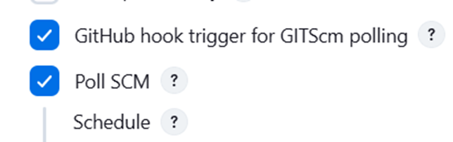
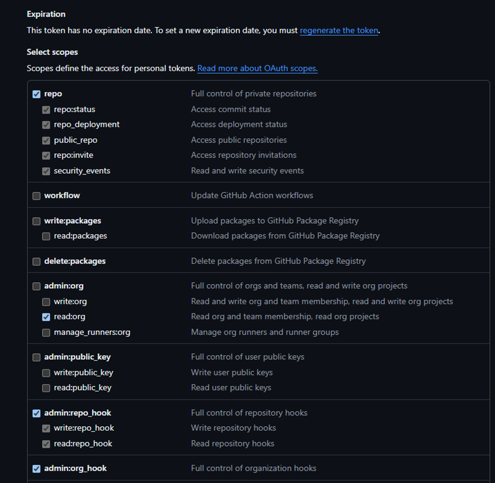
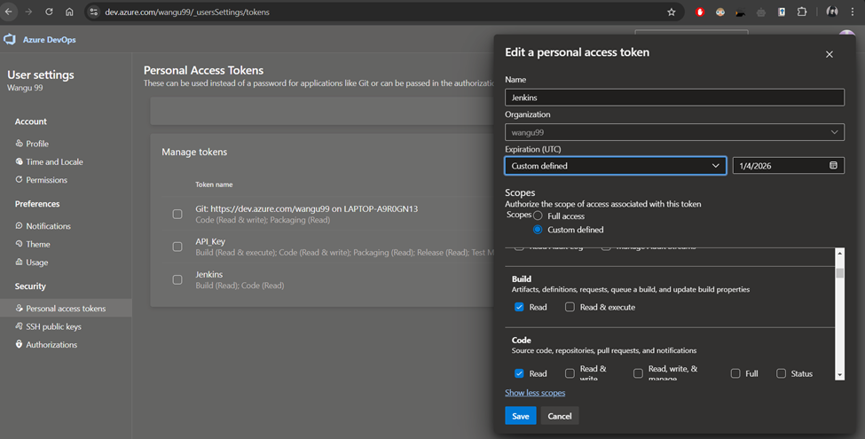

# DevSecOps
# Azure DevOps and GitHub for DevSecOps

# Steps to create a simple Net 6.0 Project:
# Step 1: Set Up Your Environment
Download and install the .NET 6 SDK from the official .NET website.
Download and install Visual Studio Code from the official website.
Search for "C#" and install the official extension provided by Microsoft.

# Step 2:
Create a simple Net Application using the terminal with: 
dotnet new mvc -n SimpleNetApp

# Add a controller in Controllers folder name it Controller.cs

# To build and run:
Cd SimpleNetApp
dotnet build
dotnet run

# Step 3:
# Back to home folder and create a testing project for unit testing:
cd ..
dotnet new xunit -n SimpleNetApp.Tests

# Add the reference into the testing project
cd SimpleNetApp.Tests
dotnet add reference ../SimpleMvcApp/SimpleMvcApp.csproj

# Add a Controller for a simple Unit Testing class ControllerTests.cs

# To test:
cd SimpleNetApp.Tests
dotnet test

# Steps to make a CICD with jenkins using a dockerfile:
# Step 1:
Download and install WSL from the official website

# Install Docker using the WSL following the below script:
#!/bin/bash

# Update and upgrade the system
sudo apt update && sudo apt upgrade -y

# Install Docker dependencies
sudo apt install -y apt-transport-https ca-certificates curl software-properties-common

# Add Docker’s official GPG key
curl -fsSL https://download.docker.com/linux/ubuntu/gpg | sudo gpg --dearmor -o /usr/share/keyrings/docker-archive-keyring.gpg

# Add Docker’s repository
echo "deb [arch=$(dpkg --print-architecture) signed-by=/usr/share/keyrings/docker-archive-keyring.gpg] https://download.docker.com/linux/ubuntu $(lsb_release -cs) stable" | sudo tee /etc/apt/sources.list.d/docker.list > /dev/null

# Update the package list
sudo apt update

# Install Docker Engine
sudo apt install -y docker-ce docker-ce-cli containerd.io

# Start Docker service
sudo service docker start

# Add the current user to the Docker group
sudo usermod -aG docker $USER

# Configure Docker to start automatically in WSL
echo "sudo service docker start" >> ~/.bashrc

# Verify Docker installation
docker --version

echo "Docker installation completed successfully!"

# Step 2:
# Create a dockerfile to contain Jenkins lts version

# Install updates and dependencies:
RUN apt-get update && apt-get install -y

# Build the Docker image
docker build -t jenkins .

# Run the Jenkins Container
docker run -p 8899:8899 -v ./jenkins_container:/var/jenkins_home --name jenkins -d jenkins

# Step 3: 
# Create a pipeline of any name and check the box the 2 boxes:

# For GitHub, create a generate a API token following access rights for a private repository project:

# For AzureDevOps, create a generate a PAT/API token following access rights for a private repository project:
