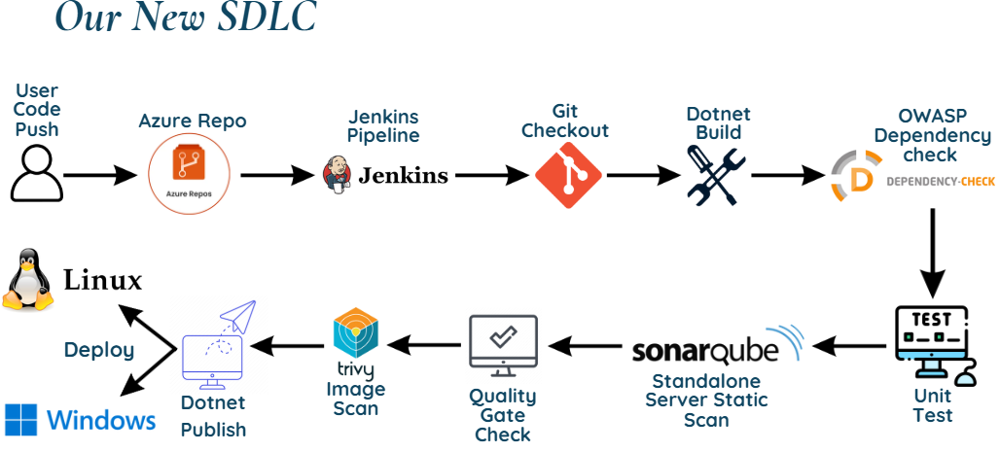
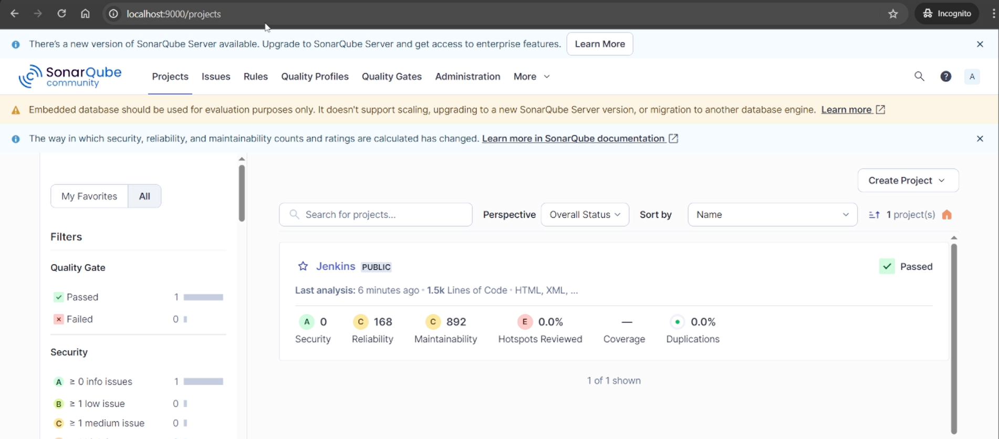
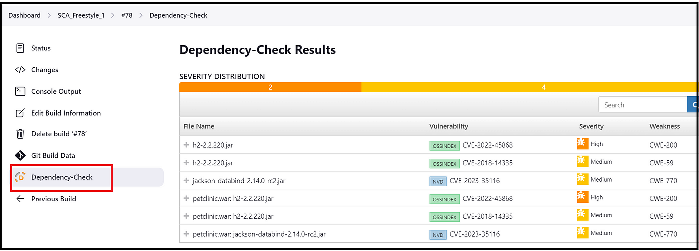

## Table of Contents

1. [System Overview](#system-overview)
2. [Prerequisites](#prerequisites)
3. [Initial Setup](#initial-setup)
4. [Docker Configuration](#docker-configuration)
5. [Jenkins Setup](#jenkins-setup)
6. [Security Scanning](#security-scanning)
7. [Pipeline Implementation](#pipeline-implementation)
8. [Deployment](#deployment)
9. [Maintenance](#maintenance)
10. [Troubleshooting](#troubleshooting)

---

## System Overview

### Network Architecture

- **Jenkins**: `172.20.0.2:8899`
- **SonarQube**: `172.20.0.3:9000`
- **Nginx**: `172.20.0.4:8080 (SSH:2222)`

---

## Prerequisites

### 1. System Requirements

```bash
# Install WSL (Windows) or use native Linux
wsl --install

# Install Docker
sudo apt update && sudo apt install -y docker.io docker-compose
sudo systemctl enable docker
sudo systemctl start docker
sudo usermod -aG docker $USER
```

### 2. .NET 6 SDK Installation

```bash
wget https://dot.net/v1/dotnet-install.sh -O dotnet-install.sh
chmod +x dotnet-install.sh
./dotnet-install.sh --version 6.0.400
```

---

## Initial Setup

### Clone Repository

```bash
git clone https://github.com/tohxuewang99/DevSecOps
cd DevSecOps
```

### Start Containers

```bash
docker-compose up -d --build
```

---

## Docker Configuration

### `docker-compose.yml`

```yaml
version: '3'
services:
  jenkins:
    build:
      context: .
      dockerfile: jenkins.dockerfile
    ports: ["8899:8899"]
    volumes:
      - ./jenkins_home:/var/jenkins_home
    networks:
      MyCustomNetwork:
        ipv4_address: 172.20.0.2

  sonarqube:
    image: sonarqube:latest
    ports: ["9000:9000"]
    networks:
      MyCustomNetwork:
        ipv4_address: 172.20.0.3

  nginx:
    build:
      context: .
      dockerfile: nginx.dockerfile
    ports:
      - "8080:80"
      - "2222:22"
    networks:
      MyCustomNetwork:
        ipv4_address: 172.20.0.4

networks:
  MyCustomNetwork:
    ipam:
      config:
        - subnet: 172.20.0.0/24
```

### `jenkins.dockerfile`

```dockerfile
FROM jenkins/jenkins:lts

USER root
RUN apt-get update && \
    apt-get install -y wget apt-transport-https openssh-client jq && \
    wget https://packages.microsoft.com/config/ubuntu/20.04/packages-microsoft-prod.deb -O packages-microsoft-prod.deb && \
    dpkg -i packages-microsoft-prod.deb && \
    apt-get update && \
    apt-get install -y dotnet-sdk-6.0 libicu-dev && \
    wget https://github.com/aquasecurity/trivy/releases/download/v0.45.0/trivy_0.45.0_Linux-64bit.deb && \
    dpkg -i trivy_0.45.0_Linux-64bit.deb

ENV JENKINS_OPTS="--httpPort=8899"
USER jenkins
EXPOSE 8899
```

### `nginx.dockerfile`

```dockerfile
FROM nginx:alpine

RUN apk add --no-cache bash wget icu-libs libgcc libstdc++ openssh && \
    wget https://dot.net/v1/dotnet-install.sh && \
    chmod +x dotnet-install.sh && \
    ./dotnet-install.sh --version 6.0.400 --install-dir /usr/share/dotnet && \
    ln -s /usr/share/dotnet/dotnet /usr/bin/dotnet

RUN adduser -D -u 1000 admin_user && \
    echo "admin_user:verylongsecretpassword" | chpasswd

RUN sed -i 's/user nginx;/user admin_user;/g' /etc/nginx/nginx.conf

EXPOSE 80 22
CMD ["sh", "-c", "ssh-keygen -A && /usr/sbin/sshd -D & nginx -g 'daemon off;'"]
```

---

## Jenkins Setup

### Access Jenkins

Open your browser: [http://localhost:8899](http://localhost:8899)

### Install Required Plugins

- OWASP Dependency Check
- SonarQube Scanner
- SSH Agent
- Pipeline

### Configure Credentials

- Azure DevOps PAT


- SonarQube Token


- SSH Keys


---

## Security Scanning

- OWASP Dependency Check
- SonarQube Static Analysis
- Trivy for container images

---

## Pipeline Implementation

### `Jenkinsfile`

```groovy
pipeline {
    agent any
    stages {
        stage('Git Checkout') {
            steps {
                //Enter your git branch type, azure repo url and credentials created for Azure Repo PAT
                git branch: 'main', url: 'https://dev.azure.com/wangu99/_git/CICD_Tests_with_Jenkins_and_Netcore_6', credentialsId: 'Azure'
                sh 'rm -rf .git'
            }
        }
        stage('Build') {
            steps {
                script {
                    //Point to the correct Application directory to build
                    dir('APP_Development_ENV/SimpleNetApp') {
                        sh '''dotnet clean
                        dotnet nuget locals all --clear
                        dotnet restore
                        dotnet build'''
                    }
                }
            }
        }
        stage('OWASP Dependency check') {
            steps {
                dependencyCheck additionalArguments: ''' -o './' -s './' --format "XML" --format "HTML" --prettyPrint --suppression "suppression.xml" ''', odcInstallation: 'OWASP'
                dependencyCheckPublisher pattern: 'dependency-check-report.xml'
            }
        }
        stage('Unit Testing') {
            steps {
                script {
                    //Point to the correct Application directory to do unit testing
                    dir('APP_Development_ENV/SimpleNetApp.Tests') {
                        sh 'dotnet test'
                    }
                }
            }
        }
        stage('SonarQube Analysis') {
            steps {
                script {
                    def scannerHome = tool 'SonarLatest';
                    //Confirmed localhost does not work, must use IP or URL
                    //Need projectkey to work, the project name created in SonarQube
                    //Runs with the SonarQube Token Credential
                    withSonarQubeEnv("SonarQube") {
                        withCredentials([string(credentialsId: 'Sonar_token', variable: 'SONARQUBE_TOKEN')]) {
                            sh "${scannerHome}/bin/sonar-scanner \
                            -Dsonar.projectKey=Jenkins \
                            -Dsonar.sources=${env.WORKSPACE} \
                            -Dsonar.host.url=http://172.20.0.3:9000 \
                            -Dsonar.token=${SONARQUBE_TOKEN} \
                            -Dsonar.dotnet.excludeTestProjects=true \
                            -Dsonar.qualitygate.wait=true"
                        }
                    }
                }
            }
		}
        stage('Quality Gate') {
            steps {
                script {
                    withSonarQubeEnv("SonarQube") {
                        withCredentials([string(credentialsId: 'Sonar_token', variable: 'SONARQUBE_TOKEN')]) {
                            // Query the SonarQube API for the Quality Gate status
                            def projectKey = 'Jenkins' // Match the projectKey from the scan
                            def qualityGateStatus = sh(script: """
                                curl -u ${SONARQUBE_TOKEN}: \
                                http://172.20.0.3:9000/api/qualitygates/project_status?projectKey=${projectKey} \
                                | jq -r '.projectStatus.status'
                            """, returnStdout: true).trim()
        
                            if (qualityGateStatus != 'OK') {
                                error "Pipeline aborted due to failing Quality Gate: ${qualityGateStatus}"
                            }
                        }
                    }
                }
            }
        }
        stage('Scan Docker Images') {
            steps {
                script {
                    try {
                        sh 'trivy image --exit-code 1 --severity HIGH,CRITICAL jenkins/jenkins:lts'
                        sh 'trivy image --exit-code 1 --severity HIGH,CRITICAL sonarqube:latest'
                    } catch (Exception e) {
                        echo "Trivy scan failed: ${e.getMessage()}"
                    }
                }
            }
        }
        stage('Publish .NET Application') {
            steps {
                script {
                    dir('APP_Development_ENV/SimpleNetApp') {
                        sh 'dotnet clean'
                        //Publish self-contained artefact failed for linux
                        //sh 'dotnet publish -c Release -r linux-x64 --self-contained -p:PublishReadyToRun=true --framework net6.0 -o ./APP_Deployment_ENV/linux_x64'
                        sh 'dotnet publish -c Release -p:PublishReadyToRun=false --self-contained false --framework net6.0 -o ./APP_Deployment_ENV/linux_x64'
                        sh 'dotnet clean'
                        sh 'dotnet publish -c Release -r win-x64 --self-contained -p:PublishReadyToRun=true --framework net6.0 -o ./APP_Deployment_ENV/win_x64'
                    }
                }
            }
        }
        stage('Deploy to Linux') {
            steps {
                //using SSH with Private Key Credential to do Secure Copy (SCP), kill previous running application when new update arrives
                sshagent(credentials: ['jenkins-ssh-key']) {
                    sh """
                    # Copy the published files to the Nginx container
                    scp -o StrictHostKeyChecking=no -r ./APP_Development_ENV/SimpleNetApp/APP_Deployment_ENV/linux_x64/* admin_user@172.20.0.4:/usr/share/nginx/html/
    
                    ssh -o StrictHostKeyChecking=no admin_user@172.20.0.4 bash << 'EOF'
                        cd /usr/share/nginx/html/
    
                        # Find and kill the previous process
                        PID=\$(pgrep -f SimpleNetApp.dll)
                        if [ ! -z "\$PID" ]; then
                            echo "Stopping existing application (PID: \$PID)"
                            kill -9 \$PID
                        fi
    
                        # Start the application in the background
                        nohup dotnet SimpleNetApp.dll > /dev/null 2>&1 &
                        echo "Application restarted successfully"
                """
                }
            }
        }
        stage('Deploy to Window') {
            steps {
                //Failed to deploy for Windows due to resource constrain but tested to be working using shared volume
                // sshagent(credentials: ['windows_ssh_key']) {
                // scp -o StrictHostKeyChecking=no -r /app_deployment/windows_x64/* Administrator@windows-server-ip:/path/to/deploy/
                // ssh -o StrictHostKeyChecking=no Administrator@windows-server-ip powershell -Command "& {
                //     cd /path/to/deploy
                //     Stop-Process -Name SimpleNetApp -ErrorAction SilentlyContinue
                //     Start-Process -FilePath .\\SimpleNetApp.exe
                echo 'Deployment to Windows Manually, Successful!'
            }
        }
    }
    post {
        success {
            echo 'Deployment successful!'
        }
        failure {
            echo 'Deployment failed!'
        }
    }
}
```
---

## Deployment

### Linux Deployment Process

- SSH-based file transfer to Nginx container
- Non-root user execution
- Automatic process management
- To install .Net 6 SDK on deployment environment due to self-contained publish failure
- Configure with reverse Proxy to point the original Application from port 5000 to 8080
- Kills the previous program and runs the latest updated Application

### Windows Deployment

- Manual deployment process
- Self-contained executable

---

## Service Hook

### Azure DevOps Servicehook on Git Code Push to Trigger Automated Pipeline Build
- Generate a Jenkins API token

- Create ServiceHook in Azure DevOps using the Jenkins API Token pointing to the expected Pipeline


## Maintenance

### Common Commands

```bash
# Stop all containers
docker-compose down

# View logs
docker-compose logs -f jenkins
docker-compose logs -f sonarqube

# Cleanup
docker system prune -a

# Access containers
docker exec -it jenkins bash
docker exec -it nginx sh
```

---

## Troubleshooting

### .NET SDK Not Found

```bash
docker exec -it jenkins bash
dotnet --list-sdks
./dotnet-install.sh --version 6.0.400
```

### SSH Connection Issues

```bash
ssh -v admin_user@localhost -p 2222
cat ~/.ssh/authorized_keys
```

### SonarQube Quality Gate Failing

- Check project quality gate configuration
- Verify metric thresholds
- Check analysis logs

### Jenkins Plugin Errors

- Update plugins
- Check compatibility matrix
- Review Jenkins logs

---

## Visual Reference

- Jenkins Pipeline View

- SonarQube Dashboard

- OWASP Report Sample
