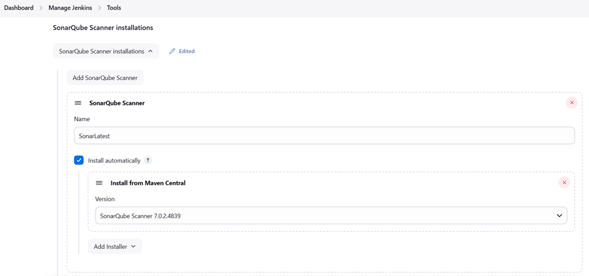
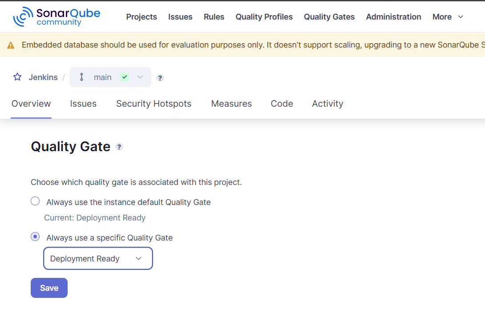

# DevSecOps
# Azure DevOps and GitHub for DevSecOps

# Steps to create a simple Net 6.0 Project, to simulate company application:
# Step 1: Set Up Your Environment
Download and install the .NET 6 SDK from the official .NET website.
Download and install Visual Studio Code from the official website.
Search for "C#" and install the official extension provided by Microsoft.

# Step 2:
Create a simple Net Application using the terminal with: 
dotnet new mvc -n SimpleNetApp

# Add a controller in Controllers folder name it Controller.cs

# To build and run:
Cd SimpleNetApp
dotnet build
dotnet run

# Step 3:
# Back to home folder and create a testing project for unit testing:
cd ..
dotnet new xunit -n SimpleNetApp.Tests

# Add the reference into the testing project
cd SimpleNetApp.Tests
dotnet add reference ../SimpleMvcApp/SimpleNetApp.csproj

# Add a Controller for a simple Unit Testing class ControllerTests.cs

# To test:
cd SimpleNetApp.Tests
dotnet test

# Steps to make a CICD with jenkins using a dockerfile:
# Step 1:
Download and install WSL from the official website

# Install Docker using the WSL following the below script:
#!/bin/bash

# Update and upgrade the system
sudo apt update && sudo apt upgrade -y

# Install Docker dependencies
sudo apt install -y apt-transport-https ca-certificates curl software-properties-common

# Add Docker’s official GPG key
curl -fsSL https://download.docker.com/linux/ubuntu/gpg | sudo gpg --dearmor -o /usr/share/keyrings/docker-archive-keyring.gpg

# Add Docker’s repository
echo "deb [arch=$(dpkg --print-architecture) signed-by=/usr/share/keyrings/docker-archive-keyring.gpg] https://download.docker.com/linux/ubuntu $(lsb_release -cs) stable" | sudo tee /etc/apt/sources.list.d/docker.list > /dev/null

# Update the package list
sudo apt update

# Install Docker Engine
sudo apt install -y docker-ce docker-ce-cli containerd.io

# Start Docker service
sudo service docker start

# Add the current user to the Docker group
sudo usermod -aG docker $USER

# Configure Docker to start automatically in WSL
echo "sudo service docker start" >> ~/.bashrc

# Verify Docker installation
docker --version

echo "Docker installation completed successfully!"

# Step 2:
# Create a dockerfile to contain Jenkins lts version

# Install updates and dependencies:
RUN apt-get update && apt-get install -y

# Build the Docker image
docker build -t jenkins .

# Run the Jenkins Container
docker run -p 8899:8899 -v ./jenkins_container:/var/jenkins_home --name jenkins -d jenkins

# Create a pipeline to start the CICD for checkout to retrieve the files from a private repository
# Step 1: 
# Create a pipeline of any name and check the box the 2 boxes:

# For GitHub, create a generate a API token following access rights for a private repository project:

# For AzureDevOps, create a generate a PAT/API token following access rights for a private repository project:

# Add the credentials in Jenkins with the created token following:

# Step 2:
# Install Plugin Pipeline: Stage View:

# Update jenkinsfile and try building the pipeline

# Update jenkinsfile by adding new steps to run Unit Testing for reliability testing

# Failed to build and run unit testing, jenkins .net SDK does not support .net 6.0 contrary to the documentation, more infomation on
# https://medium.com/@nestor.panu/building-an-asp-net-6-application-on-docker-based-jenkins-d6c8aaf94756
# https://github.com/dotnet/core/issues/6172

# Update dockerfile to install .net 6.0 sdk during build

# Step 3:
# Install Plugin OWASP Depedency Check for Software Composition Analysis (SCA):

# Add tools to install the latest OWASP Depedency Check directly from github:

# Update jenkinsfile to test the OWASP dependency check step, change all format to only 2 .xml and .html

# Download either the .xml or .html report and create a suppression.xml file to prevent any false positive security vulnerabilities found in the depedencies

# Update the jenkins file and point onto the suppression.xml to suppress the false positive

# Step 4:
# Update dockerfile to install sonarlint or sonarlint CLI, linter application used by company and installed for emulation as a static analysis tool

# Update jenkins file on previous commit to run the sonarlint scan

# Failed to run the Sonarlint pipeline stage as Sonarlint is an IDE extension based linter and SonarLint CLI is archived since 2018 and no longer support CLI usage even though Sonarlint by itself is still supported as of today as an SONARQUBE FOR IDE, https://github.com/SonarSource/sonarlint-cli,https://stackoverflow.com/questions/46975487/sonarlint-command-line-version-dropped

# Swapped to SonarQube Cloud to run the analysis using API calls

# SonarQube Cloud does works but not in the way the organisation would want as the free version only allows public repository and will display the analysis results to the public which could be detrimental for our organisation, as I do not have codebase access and do not wish for any analysis results to leak after handing the project over to the organisation, we have decided to move forward with a SonarQube Standalone Server instead of SonarQube Cloud until we have fully adopted all the application over

# Step 5:
# To allow SonarQube Standalone Server and Jenkins integration

# Redo dockerfile to create a dockercompose to run multiple images with custom private communication with one another
# Run sonarqube server & jenkins together with dockercompose, set up a project locally, generate a global analysis token to be used in jenkins

# Install SonarQube Scanner plugin in jenkins

# Set up the global configuration in System, Server URL pointing to the SonarQube Server and Server Authentication token pointing to a new credential created with secret text using the sonarqube token

# Set up the global configuration in Tools, to install the latest SonarQube Scanner during pipeline build

# Updated jenkinsfile with Dsonar commands to trigger project scan with token credentials created in system and installation created in tools pointing towards the SonarQube Scanner Server

# Step 6:
# Design quality gate for deployment ready quality to proceed only, if not abort the pipeline

# update jenkins file to query check if quality has been successful after a wait timer, only works as i have -Dsonar.qualitygate.wait=true, unsure if the quality gate check is using previous success quality check, installed jq(a lightweight command-line JSON processor) in jenkins dockerfile to help retrieve the qualitygate status using curl command

# Quality for deployment ready if failed to send a email notification through a SMTP server and service account

# Step 7:
# Update jenkinsfile to publish .Net 6 application to deployment ready for linux and windows OS
# Failed to publish a self contained artefact for a linux-x64 targetted framework with error MSB4018 but works when publishing for windows-x64
# Manual and local publish of the same .Net application seems to work
# Tried multiple ways such as installing the latest .NET 8 version while publishing to .Net 6 version but still unsuccessful
# Decide to not create a self contained artefact for linux publish allowing it to be used for all OS but needs to have .Net 6.0 SDK installed.

# using open ssh to do secure copy protocol to bring the published file for linux deployment into the nginx:alpine image
# using ssh-key gen to generate public and private key with password for SSH in jenkins
# copying the public key create into the nginx ssh authorized key to complete the communication
# note all of these are done outside of docker in local env first for persistence and no change of authorized keys
<!-- 
cd jenkins_home/.ssh
ssh-keygen -t ecdsa -b 521 -C "jenkins@172.20.0.2" -N "<Type your secret or password here>"
Key
cat Key.pub
cat Key

cd ../../
echo "<enter the content of the public key here>" >> ./nginx/root_ssh/authorized_keys
chmod 700 ./nginx/root_ssh
chmod 600 ./nginx/root_ssh/authorized_keys
-->

# Step 8: Deploy to Linux environment
# nginx.dockerfile to install .Net 6.0 sdk as the publish is not self-contained
# updated jenkinsfile to use nohup to run the application and nginx.conf to do a reverse proxy to port 8080
# install ssh agent plugin to allow SCP and SSH from pipeline and update credentials wth the private key and password

# Step 9: Deployment to Windows environment / local
# updated jenkins to point back to local folder for persistence in deployment files as a shared/reflected both ways
# ran out of resource for another windows image creation
# run the deployment file in DevSecOps\APP_Deployment_ENV\win_x64\SimpleNetApp.exe --urls=http://localhost:1234

# Step 10: OWASP guidelines
# updated files based on OWASP guideline for docker deployment and security
# removed root user as ssh user for nginx:alpine app reverse proxy deployment
# trivy docker image scan for vulnerabilities using jenkins pipeline

# Step 11: Webhook from Azure DevOps to jenkins
# generate a jenkins API token for Azure DevOps Service hook

# Go to Azure DevOps and create a new service hook

# Check if jenkins pipeline auto builds when code is pushed to repository
